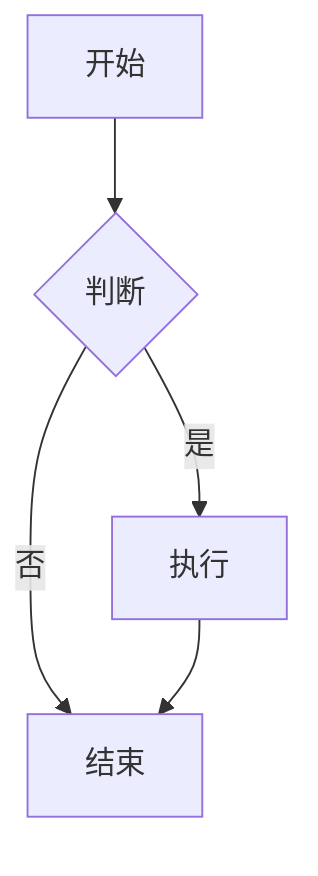
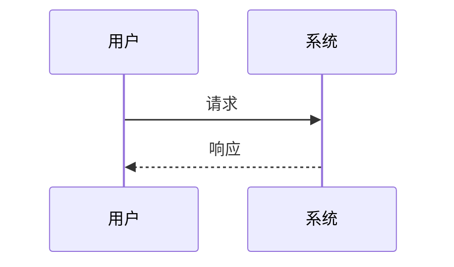

<!-- 这是一段 Markdown 注释，不会显示 -->

# Markdown 全样式示例文档

> 说明：Markdown 有多种方言，本文覆盖 CommonMark、GFM 以及常见扩展。不同渲染器支持程度不同。

## 目录

- [1. 标题](#1-标题)
- [2. 段落与换行](#2-段落与换行)
- [3. 强调与文本样式](#3-强调与文本样式)
- [4. 引用](#4-引用)
- [5. 列表](#5-列表)
- [6. 代码](#6-代码)
- [7. 链接](#7-链接)
- [8. 图片](#8-图片)
- [9. 表格](#9-表格)
- [10. 分隔线](#10-分隔线)
- [11. HTML](#11-html)
- [12. 转义字符](#12-转义字符)
- [13. 脚注](#13-脚注)
- [14. 数学公式](#14-数学公式)
- [15. 图表 Mermaid](#15-图表-mermaid)
- [16. 徽章与表情](#16-徽章与表情)
- [17. 提示与折叠](#17-提示与折叠)
- [18. 媒体与嵌入](#18-媒体与嵌入)
- [19. 其他扩展](#19-其他扩展)

部分渲染器支持自动目录：

[TOC]

---

## 1. 标题

# H1 一级标题
## H2 二级标题
### H3 三级标题
#### H4 四级标题
##### H5 五级标题
###### H6 六级标题

一级标题 Setext
===

二级标题 Setext
---

## 2. 段落与换行

这是第一个段落。Markdown 中用一个空行分隔段落。

这是第二个段落。
这一行与上一行属于同一段落，通常渲染为同一段。

这一行末尾有两个空格，  
所以这里会强制换行。

这一行末尾使用反斜杠，\
也会强制换行。

也可以使用 HTML：第一行<br>第二行。

## 3. 强调与文本样式

*斜体* 或 _斜体_  
**粗体** 或 __粗体__  
***粗斜体*** 或 ___粗斜体___  
~~删除线~~  
<u>下划线</u>  
<ins>插入下划线</ins>  
<del>删除线 HTML</del>  
<mark>高亮</mark>  
==高亮（部分扩展）==  
H~2~O 下标（部分扩展）  
X^2^ 上标（部分扩展）  
<sub>下标</sub> 和 <sup>上标</sup>  
<small>小号文字</small>  
<abbr title="HyperText Markup Language">HTML</abbr>  
<cite>引用作品名</cite>  
<kbd>Ctrl</kbd> + <kbd>C</kbd>  
:smile: :rocket: :+1: （emoji 扩展）  
&copy; &amp; &lt; &gt; &nbsp;

## 4. 引用

> 一级引用
>
> 引用中可以包含 **粗体**、*斜体*、`代码`。
>
> > 二级嵌套引用
> >
> > > 三级嵌套引用

> [!NOTE]
> GFM 提示：普通信息。

> [!TIP]
> 提示信息。

> [!IMPORTANT]
> 重要信息。

> [!WARNING]
> 警告信息。

> [!CAUTION]
> 注意信息。

## 5. 列表

### 无序列表

- 项目一
- 项目二
  - 子项目 A
  - 子项目 B
    - 子项目
* 使用星号
+ 使用加号

### 有序列表

1. 第一项
2. 第二项
   1. 子项 2.1
   2. 子项 2.2
3. 第三项

从指定数字开始：

3. 第三项
4. 第四项

从指定数字开始：

3. 第三项
4. 第四项

### 任务列表

- [x] 已完成任务
- [ ] 未完成任务
- [ ] 带 **格式** 的任务
  - [x] 子任务

### 定义列表（部分扩展）

术语 1
: 定义 1

术语 2
: 定义 2
: 另一个定义

## 6. 代码

行内代码：`printf("Hello")`、`<div>`、`npm install`。

缩进代码块：

    function hello() {
      console.log("Hello");
    }

围栏代码块：

```javascript
function hello(name) {
  console.log(`Hello, ${name}!`);
}
```

```python
def hello(name: str) -> None:
    print(f"Hello, {name}!")
```

```diff
+ 新增行
- 删除行
! 注意行
+ 新增行
- 删除行
! 注意行
+ 新增行
- 删除行
! 注意行
```

```text
纯文本代码块。
这里不能直接包含三个反引号，否则会提前结束代码块。
```

## 7. 链接

行内链接：[OpenAI](https://openai.com "OpenAI 官网")

行内链接：[OpenAI](https://openai.com)

自动链接：<https://www.example.com>

邮箱：<mailto:test@example.com>

锚点链接：[回到标题](#1-标题)

相对链接：[README](./README.md)

引用式链接定义：

[github]: https://github.com "GitHub"

## 8. 图片


带链接的图片：

[](https://example.com)

引用式图片：

![Logo][logo]

[logo]: https://100.99.88.77/src/head.avif "Logo"

## 9. 表格

| 左对齐 |          居中对齐           | 右对齐 |
| :----- | :-------------------------: | -----: |
| 单元格 |           单元格            | 单元格 |
| 内容   |          **粗体**           | `代码` |
| 长内容 | [链接](https://example.com) |     42 |

转义管道：

| 名称   | 说明           |
| ------ | -------------- |
| A \| B | 使用 `\|` 转义 |

## 10. 分隔线

---

***

___

## 11. HTML

<div style="padding: 8px; border: 1px solid #ccc;">
  这是一个 HTML 块。
</div>

<p align="center">居中段落</p>

<details>
  <summary>点击展开</summary>
  折叠内容。
</details>

我的世界<span class="hover-hint">显示的文字<span class="hover-hint__tooltip"><span class="hint-title">提示标题（可选）</span>这里写提示内容，可以换行，支持简单文本。</span></span>是

<!-- HTML 注释不会显示 -->

## 12. 转义字符

\*不是斜体\*  
\_不是斜体\_  
\# 不是标题  
\[不是链接\]  
\`不是代码\`  
\> 不是引用  
\+ 不是列表  
\- 不是列表  
\. 不是有序列表  
\! 不是图片  
\| 不是表格分隔符  
\{ \} \( \) \# \+ \- \. \!

## 13. 脚注

这里有一个脚注[^1]，这里还有另一个[^longnote]。

[^1]: 这是脚注内容。

[^longnote]: 这是多行脚注。
    缩进可以继续脚注内容。
    
    也可以包含代码和列表：
    
    - 项目一
    - 项目二

## 14. 数学公式

行内公式：$E = mc^2$

块级公式：

$$
\frac{n!}{k!(n-k)!} = \binom{n}{k}
$$

行内公式：$E = mc^2$，还有 $a^2 + b^2 = c^2$。

$$
\frac{n!}{k!(n-k)!} = \binom{n}{k}
$$

```js
const price = "$9.9";  // 代码块里的 $ 不会被当公式
```


- `$E = mc^2$` → `<span class="math-inline">\(E = mc^2\)</span>`
- 多行 `$$…$$` → `<div class="math-block">\[\frac{n!}{k!(n-k)!} = \binom{n}{k}\]</div>`
- 代码块里的 `$` 被 `INLINE_CODE_RE` 先一步保护，不会误伤。

### 两个注意点

1. **美元号歧义**：正文里写 `价格是 $5 到 $10` 时，会被误判成行内公式。真要写美元，用 `\$` 转义（已有的 `BACKSLASH_ESCAPE_RE` 会处理）。
2. **`$$` 必须独占一行开头**：块级公式的触发条件是 `s.startswith("$$")`，别在段落中间直接塞 `$$…$$`。

## 15. 图表 Mermaid





## 16. 徽章与表情


:smile: :heart: :rocket:

## 17. 提示与折叠

> [!NOTE]
> 这是一个提示块。

<details>
  <summary>展开查看详情</summary>

  这里可以放 **Markdown** 内容。

  ```js
  console.log("Hello");
  ```
</details>

## 18. 媒体与嵌入

<iframe src="https://example.com" width="300" height="150"></iframe>

<iframe frameborder="no" border="0" marginwidth="0" marginheight="0" width=330 height=86 src="//music.163.com/outchain/player?type=2&id=2755332551&auto=0&height=66"></iframe>

## 19. 其他扩展

行内 HTML 与 Markdown 混合：<span style="color: red;">红色文字</span> 和 **粗体**。

键盘输入：<kbd>Ctrl</kbd> + <kbd>Alt</kbd> + <kbd>Delete</kbd>

上标/下标：H<sub>2</sub>O，E=mc<sup>2</sup>

缩写：<abbr title="Application Programming Interface">API</abbr>

高亮：<mark>重要内容</mark>

进度条：

<progress value="70" max="100">70%</progress>

## 20. 引用式链接汇总

[OpenAI][openai]  
[GitHub][github]

[openai]: https://openai.com
[github]: https://github.com

---

## 许可证

本文档可自由使用、修改和分发。